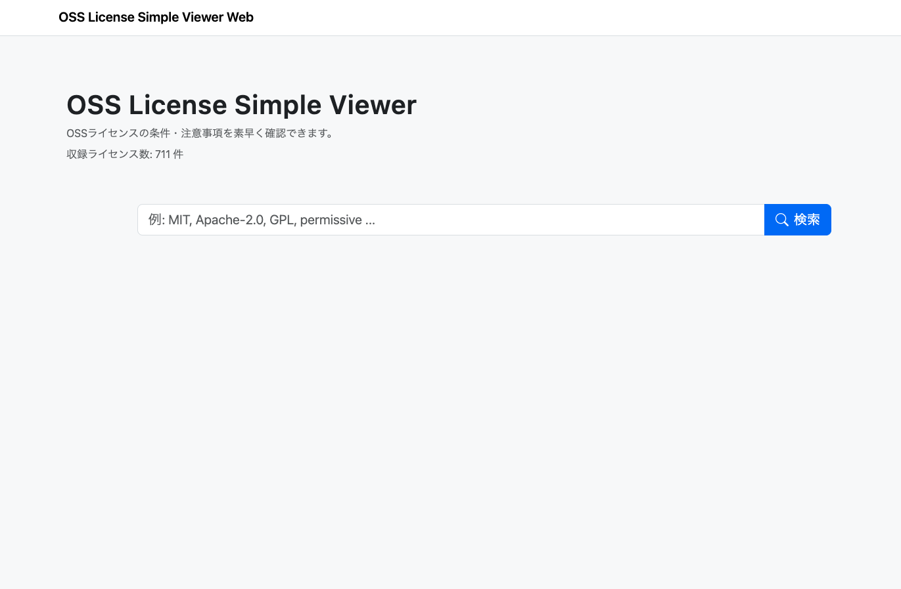
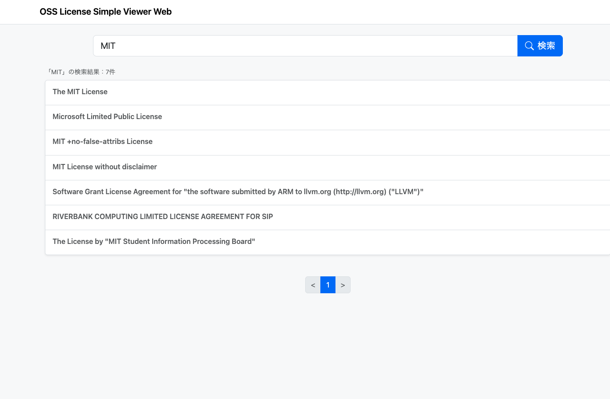
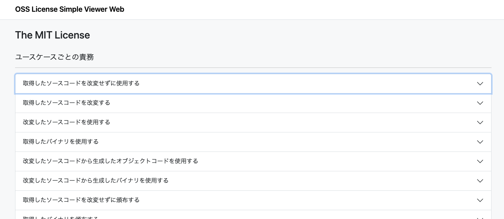
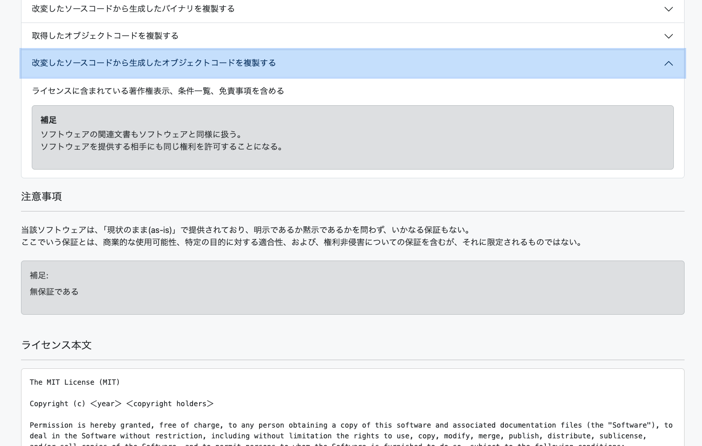

# OLSV-Web (OSS License Simple Viewer Web)

注意：本ソフトウェアは開発途中であり、今後変更を予定しています。

本ソフトウェアは、OSSライセンス情報を検索・閲覧するためのシンプルなWebアプリケーションです。

エンジニアやコンプライアンス担当者が、OSSライセンスの条件や注意事項をブラウザ上で簡単に確認できることを目的としています。

本ソフトウェアは、Dockerがインストールされている環境で動作します。

## 起動方法

以下の説明では、UNIX系OSへのインストールを想定しています。

1. Dockerをインストールします。

    詳細は、Docker公式サイト (https://www.docker.com/ja-jp/get-started/) 等をご確認ください。
 
1. 本ソフトウェアをダウンロードします。

1. ライセンスデータを用意し、本ソフトウェアの`/license-data/`にコピーします。

    ライセンスデータは、日立製作所様が公開しているOSS License Open Data (https://github.com/Hitachi/open-license) の`licenses.json`,`actions.json`,`conditions.json`,`notices.json`の4つのファイル、もしくは同様の形式で作成されたオリジナルのデータを利用できます。
  
    ```
    LICENSE_PATH=/path/to/license_data # ライセンスデータが格納されたディレクトリ
    ROOT_PATH=/path/to/root_of_this_software # 本ソフトウェアのルートディレクトリ

    cd ${ROOT_PATH}
    cp ${LICENSE_PATH}/licenses.json ${LICENSE_PATH}/actions.json ${LICENSE_PATH}/conditions.json ${LICENSE_PATH}/notices.json ./license-data/
    ```

1. 以下のコマンドでビルドを行います。

    ```
    docker image build -t olsv_web .
    ```

1. 以下のコマンドでWebアプリを起動します。
    以下のコマンドでライセンスデータの取り込みも行われます。

    ```
    docker container run --name olsv_web -p 8080:3000 olsv_web
    ```

    注意：デフォルトでは、`licenses.json`の参照(ref)先のデータが存在しない場合、以下のようなログが出力され、refの内容が無視されますのでご注意ください。

    ```
    [import] missing action ref="actions/***" (license=licenses/*** ...) The ref is ignored because ON_MISSING_REF=ignore.
    ```

1. ブラウザで http://localhost:8080/ にアクセスすると、Webアプリが表示されます。

1. コンテナは`Control+C`で停止します。
    コンテナの再稼働、削除は以下のコマンドで行えます。

    ```
    docker container start -a olsv_web # 停止したコンテナの稼働を再開
    docker container rm -f olsv_web # コンテナの削除（docker container run や docker image build をやり直す場合など）
    ```

## イメージ

ホーム画面 (/)



ライセンスの検索結果 (/licenses?q={query})



ライセンスの詳細 (/licenses/{licenses_id})





## 注意事項

本ソフトウェアはMIT Licenseの元で提供されています。必ず[ライセンス](LICENSE)の内容をご確認の上ご利用ください。

本ソフトウェアは自己責任でご利用ください。
本ソフトウェアの利用により発生したいかなる損害に対しても、開発者は責任を負いかねますので、あらかじめご了承くだだい。

本ソフトウェアはOSS License Open Dataを公開されている日立製作所様とは関係ございませんので、ご注意ください。
